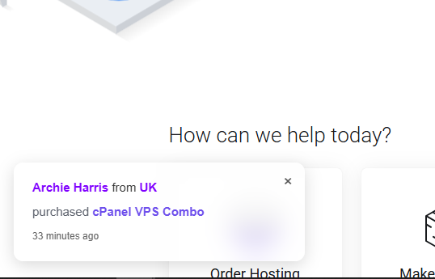

# 🔔 Social Proof for WHMCS
Real-Time Sales Notifications & Conversion Booster

Social Proof is a lightweight WHMCS addon that displays real-time purchase notifications on your website to build trust, create urgency, and increase conversions.

> “Someone from India just purchased WP Hosting”

---
### 🔔 Live Popup Notification

socialproof4.PNG

### ⚙️ Admin Configuration Panel

socialproof2.PNG

## 🚀 Features

- 🔔 Real-time sales notifications
- 🌍 Country-based buyer display
- ⚡ Lightweight & fast
- 🎨 Modern, non-intrusive popup UI
- 🔄 Supports real & simulated orders
- 🧩 Works with WHMCS products & addons
- 🛠️ Easy installation – no coding required
- 🔒 Privacy-friendly (no sensitive data shown)
- 📱 Fully responsive
- 🚫 White-label (no branding)

---

## 🆓 Free Version

The **Free version** is perfect for getting started with Social Proof.

### Included in Free Version:
- Display popup notifications
- Support for **fake (simulated) orders**
- Country-based display
- Basic popup design
- Works with WHMCS products
- Lightweight & GDPR-friendly

### Limitations:
- Limited customization
- No advanced controls
- No priority support

👉 Best for small websites or testing social proof effectiveness.

---

## ⭐ Premium Version (Recommended)

The **Premium version** unlocks full power and advanced features for serious businesses.

### Premium Features:
- ✅ Real WHMCS order integration
- ✅ Advanced popup customization
- ✅ Product-based filtering
- ✅ Control popup timing & frequency
- ✅ Better animations & UI effects
- ✅ Performance optimized queries
- ✅ Priority support
- ✅ Regular updates

### 🔗 Buy Social Proof Premium
👉 **https://portal.shrotihost.in/index.php/store/modules/social-proof-premium**

> Ideal for hosting companies, SaaS platforms, and WHMCS marketplaces.

---

## 📦 Use Cases

- Hosting & WordPress sales
- WHMCS addons & modules
- SaaS & digital products
- Promotions & flash sales
- Building trust on new websites

---

## ⚙️ Requirements

- WHMCS 8.x+
- PHP 7.4+
- MySQL / MariaDB

---

## 🛠️ Installation

1. Upload the module files to your WHMCS installation  
2. Activate via **Admin → Addon Modules**  
3. Configure settings  
4. Add fake or real entries  
5. Done 🎉  

---

## 🔐 Privacy & Security

- No client emails shown
- No IP addresses stored
- GDPR-friendly
- No sensitive user data exposed

---

## 📄 License

- **Free Version**: Allowed for personal & commercial use  
- **Premium Version**: Licensed per purchase  
- Redistribution or resale without permission is prohibited  

---

## 🤝 Support

📧 support@shrotihost.in  
🌐 https://shrotihost.in  

For premium support, please use the **Premium version**.

---

## ⭐ Upgrade to Premium

Unlock advanced features and maximize conversions:

👉 **Buy Now:**  
https://portal.shrotihost.in/index.php/store/modules/social-proof-premium
