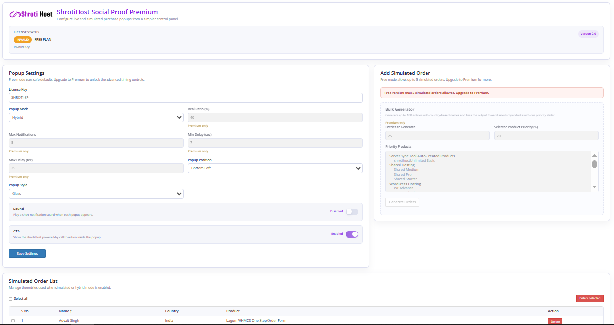
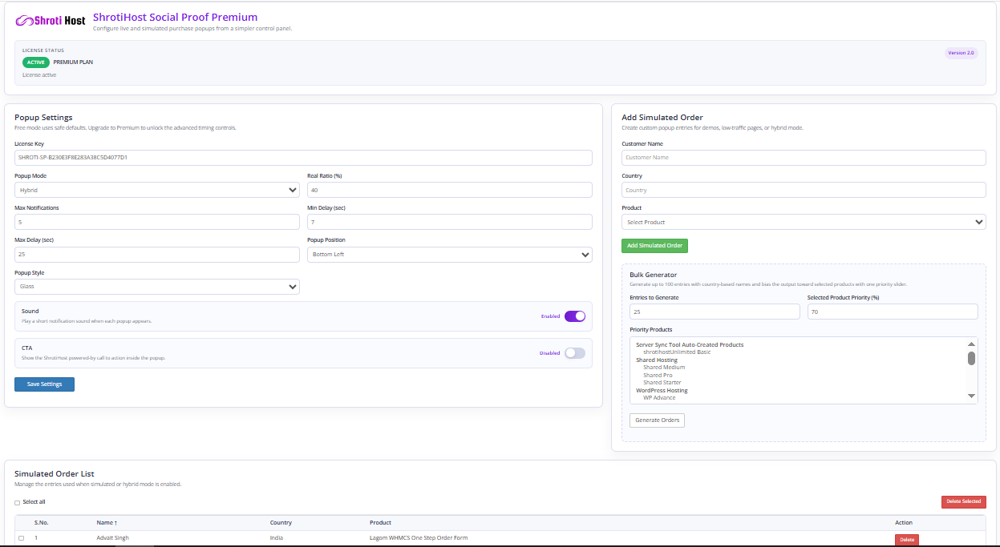
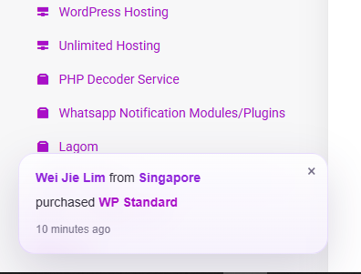
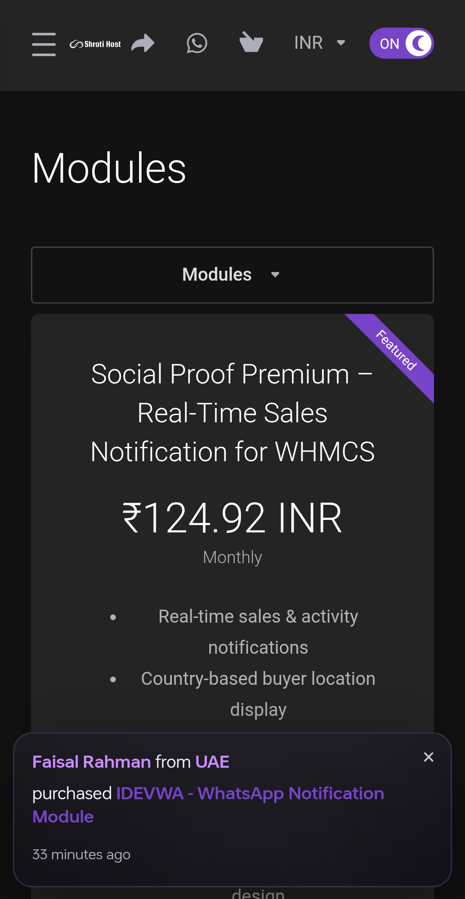
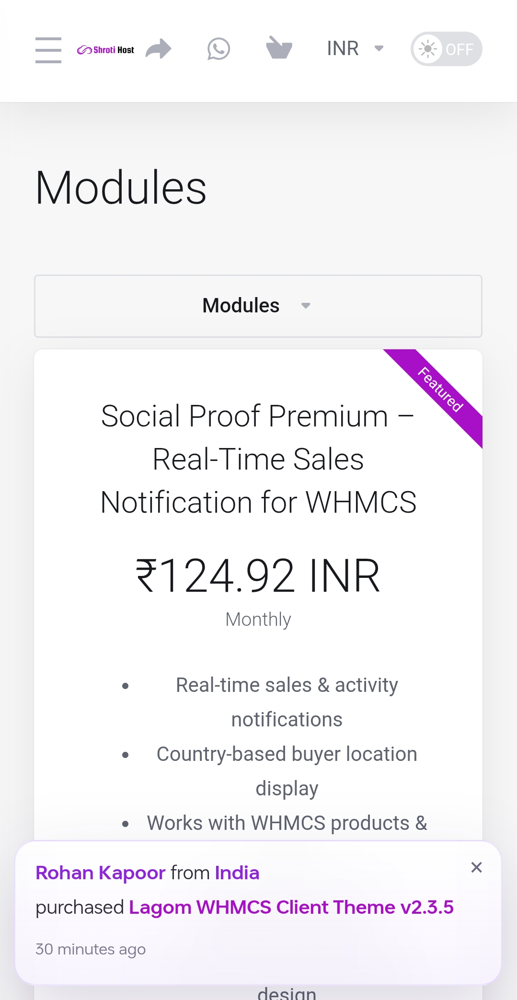

# ShrotiHost Social Proof WHMCS Module


A modern **WHMCS Social Proof module** that displays real-time purchase notifications to build trust and increase conversions on your hosting website.

It simulates recent customer activity such as orders and signups to create urgency and credibility for new visitors.

Fully compatible with **desktop & mobile**, **light & dark mode**, and the **latest WHMCS versions**.

---

# ✨ Key Features

- Real-time social proof notifications
- Simulated order generation
- Easy WHMCS integration
- Mobile & desktop responsive
- Compatible with light and dark themes
- Lightweight and optimized
- Works with latest WHMCS versions

---

# 📊 Free vs Premium

| Feature | Free | Premium |
|------|------|------|
| Popup Notifications | ✅ | ✅ |
| Simulated Orders | Up to 5 | Up to 100 |
| Popup Settings | Limited | Full Customization |
| Bulk Entry Generator | ❌ | ✅ |
| Product Priority Slider | ❌ | ✅ |
| Notification Sound | ❌ | ✅ |
| Remove Branding | ❌ | ✅ |
| CTA Button | Required | Optional |

---

# 📈 Conversion Benefits

Using social proof on your website can significantly improve visitor trust and increase sales.

### Why Social Proof Works

When visitors see real-time activity such as recent purchases or signups, it creates **trust, urgency, and credibility**.

This psychological effect encourages visitors to take action faster.

---

### Key Benefits

- **Increase Conversion Rates**  
  Real-time purchase notifications encourage visitors to complete their orders.

- **Build Customer Trust**  
  Showing recent activity reassures visitors that other customers are actively buying your services.

- **Create FOMO (Fear of Missing Out)**  
  Visitors feel urgency when they see others purchasing products.

- **Improve Engagement**  
  Dynamic notifications keep users interested and interacting with your website.

- **Boost Product Visibility**  
  Highlight popular products automatically through simulated or real activity.

---

### Perfect For

- Web hosting providers
- SaaS platforms
- Digital product stores
- WHMCS hosting businesses

---

### Real Business Impact

Many ecommerce and SaaS websites report:

- **10% – 25% higher conversion rates**
- Increased user trust
- Faster purchase decisions

By using **ShrotiHost Social Proof**, your WHMCS website can leverage these proven marketing strategies automatically.

---

# 🆓 Free Version

The free version provides basic social proof functionality.

**Limitations**

- Limited popup settings
- Maximum **5 simulated orders**
- Built-in **CTA button**
- Includes **ShrotiHost branding**

Perfect for testing the module and basic usage.

 

---

# 💎 Premium Version

The premium version unlocks powerful automation and customization features.

## Bulk Generator

Generate realistic entries automatically.

- Generate **up to 100 entries at once**
- Country-based name generation
- Bias results toward selected products using a **priority slider**

Example configuration:

```
Entries to Generate: 25
Selected Product Priority (%): 70
```

## Advanced Popup Controls

Premium users also get:

- Advanced popup customization
- Remove **CTA and branding**
- Enable **notification sound on every popup**
- Better control over popup behavior and styling
  


---

### Desktop Popup

  
</p>

### Mobile View
<p align="center">
  
  
</p>

---

# ⚙ Requirements

- WHMCS **Latest Version**
- **PHP 8.1 / 8.2 / 8.3**
- **IonCube Loader v14+**

---

# 📦 Installation

1. Upload files to

```
/modules/addons/
```

2. Login to **WHMCS Admin Panel**

```
System Settings → Addon Modules
```

4. Activate **ShrotiHost Social Proof**

5. Configure module settings.

---

# 🚀 Usage

After activation, the module will start displaying **recent activity popups** on your WHMCS frontend.

You can configure:

- Popup appearance
- Display timing
- Simulated entries
- Sound notifications (Premium)
- Product priority generator (Premium)

---

# 🔗 Upgrade to Premium

Unlock all advanced features:

https://portal.shrotihost.in/index.php/store/modules/social-proof-premium

---

# 🔒 Compatibility

| Component | Supported |
|----------|----------|
| WHMCS | Latest |
| PHP | 8.1 / 8.2 / 8.3 |
| IonCube | v14+ |
| Theme Mode | Light & Dark |
| Devices | Desktop & Mobile |

---

# 🤝 Contributing

Contributions and improvements are welcome.

Feel free to open a **Pull Request** or **Issue**.

---

# 🌐 Author

Developed by **ShrotiHost**

Website: https://shrotihost.com
